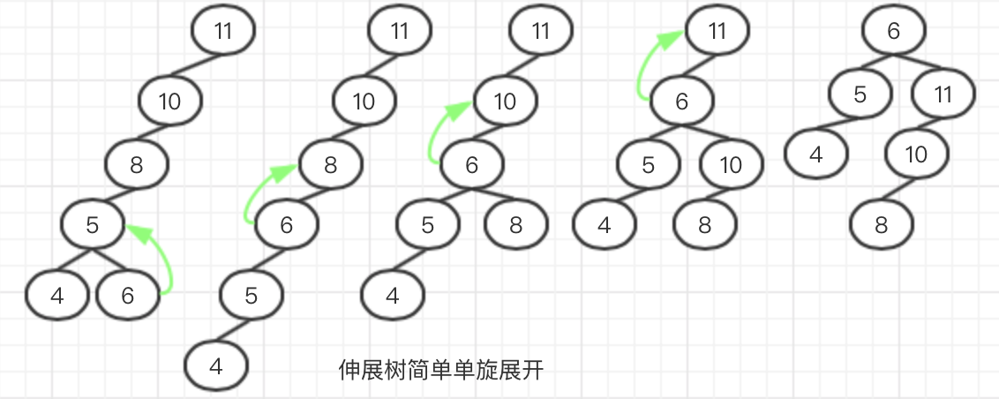
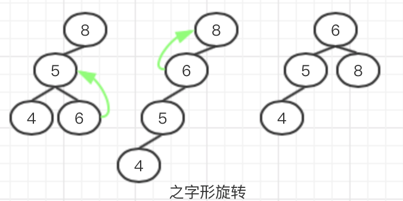
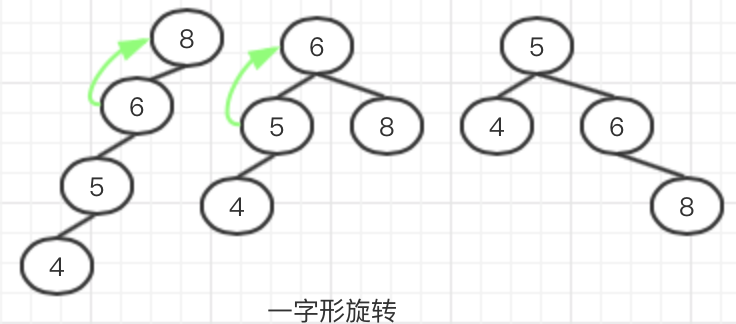
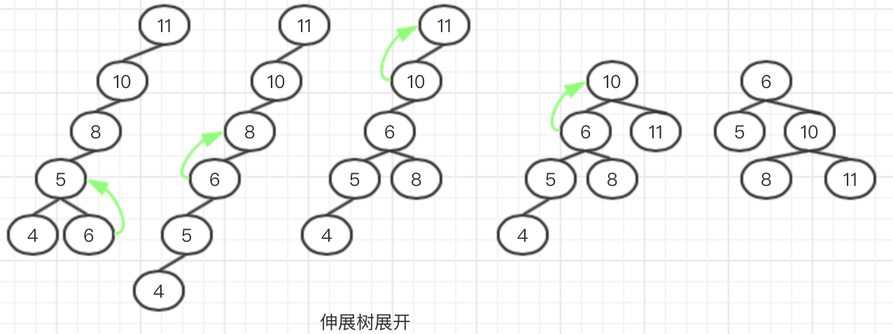
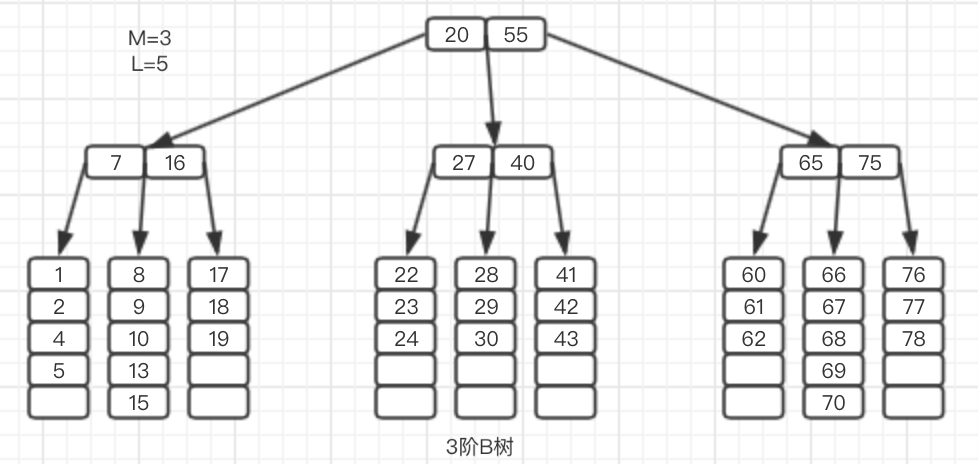

[TOC]

# 树

​	一颗树是由N个**节点**和N-1条**边**组成，最顶端的节点称作**根节点**，连接节点的线叫做**边**。


​	上图中是一颗**深度**为3的树，其中A节点是根节点，D是A的一个子节点，A是D的父节点，一个节点只能有一个父节点，但是可以拥有任意多个子节点。其中没有子节点的节点又叫**叶子节点**。使用类似的方法可以推理出**祖父节点**和**孙子节点**。

## 树的遍历

​	树的应用很多，入操作系统中的文件目录结构就是一种树形结构，每个文件或者文件夹就是一个节点，其中空文件夹和文件就是叶子节点，/root就是整棵树的根。


​	上图是Unix系统的一个文件夹目录，是一颗完整的树形结构。在遍历这棵树的时候可以使用递归操作去依次读取每个子文件夹。在处理数据的时候可以先处理子节点，然后在处理父节点，最后回到根节点，这种遍历方法叫做**后序遍历**，也可以先处理父节点，然后在处理子节点，直到所有的父节点和子节点都被处理完，这种遍历方法叫做**先序遍历**。这两种遍历方法有各自的用途，如果我们只是想读取数据，那么采用先序遍历的方法就可以，因为我们读取父节点的数据的时候（比如文件夹名称）并不需要直到子节点的信息。但是如果我们想计算当前根目录所占用的储存空间的大小，这种时候就需要使用后序遍历的方法，因为只有直到的子节点的文件大小，才能推断出父节点的大小。

## 二叉树

​	二叉树是子节点最多不能超过2个的树。其中二叉树最重要的应用就是**二叉查找树**，二叉查找树有一个特点就是任意节点的左节点都小于右节点，并且左子树中任意一个节点都小于右子树中的任意一个节点。这就要求每个树叶节点的数据都能够进行比较，所以需要实现Comparable接口。

​	如下图两棵二叉树，左边的是二叉查找树而右边的不是，因为右边的根节点的左子树中有一个节点7大于根节点。


### 二叉查找树

​	二叉查找树中每个节点最多只有两个儿子，并且左儿子小于右儿子。所以二叉查找树在查询的时候不需要全树查找，只需要根据父亲节点与当前查找节点作对比，如果小于父亲节点，就去左子树查找，直到找到树叶节点，相反就去右子树查找。

​	因为二叉查找树最多只有两个子节点，所以在实现二叉查找树的时候，可以将每个节点定义如下：

```java
private static class BinaryNode<T> {
    //父节点
    T element;
    //左子节点
    BinaryNode<T> left;
    //右子节点
    BinaryNode<T> right;
    public BinaryNode(T e) {
        this(e, null, null);
    }
    public BinaryNode(T e, BinaryNode<T> left, BinaryNode<T> right) {
        this.element = e;
        this.left = left;
        this.right = right;
    }
}
```

​	二叉查找树的API中包含构造方法，增删，contains方法，下面一一实现。

- 架构

```java
public class MyBinarySearchTree<T extends Comparable<? super T>> {
    private static class BinaryNode<T> {
        //代码如上
    }
    //根节点
    private BinaryNode<T> root;
    //构造方法
    public MyBinarySearchTree() {
        this.root = null;
    }
	//清空方法
    public void makeEmpty() {
        this.root = null;
    }
    //contains方法
    public boolean contains(T t) {
        return contains(t, root);
    }
    //查找最大值最小值--使用递归或者非递归方式都可以
    public T findMax() {
        if (this.root == null) return null;
        //递归
        return findMax(this.root);
    }
    public T findMin() {
        //非递归
        return findMin(this.root);
    }
    //插入
    public void insert(T t) {
        this.root = insert(t, this.root);
    }
    
    /**
     * 删除
     * 原理：分单双节点，如果当前删除节点只有一个子节点，则直接删除当前节点，并将子节点放到当前节点的位置上
     * 如果有删除的节点有两个子节点，则删除当前节点，并将右子节点的最小节点替换到当前删除节点，并删除右子节点	   * 的最小节点，原因是因为右子节点的最小值以为都大于最小节点，放在最右侧
     */
    public void remove(T t) {
        remove(t, this.root);
    }
}
```

- contains方法
   	在使用contains方法的时候，会根据每个节点的compareTo方法进行对比，直到找到两个相等的节点位置，否则会根据查找节点与当前节点的大小关系递归到左子树或右子树。

```java
public boolean contains(T t, BinaryNode<T> node) {
    if (node == null) return false;
    int compareResult = t.compareTo(node.element);
    if (compareResult < 0) {
        return contains(t, node.left);
    } else if (compareResult > 0) {
        return contains(t, node.right);
    } else {
        return true;
    }
}
```

- findMax方法—使用递归实现

  ​	递归查找最值的算法与contains方法类似，都是依据compareTo方法进行对比，不同的时候，contains查找的时候可以在左子树茶，也可以在右子树上查找，但是由于二叉查找树上的右子树上的节点都大于左子树，所以，在findMax方法中都是在右子树上查找的，直到找到最右子树的叶子节点为止。

```java
private T findMax(BinaryNode<T> node) {
    if (node.right == null) {
        return node.element;
    } else {
        return findMax(node.right);
    }
}
```

- findMin方法—使用非递归方式

  ​	与findMax方法算法相反，查找在二叉查找树上寻找最小值，其实就是查找最左子树的做树叶节点。使用非递归查找的时候，可以用它循环实现。

```java
public T findMin(BinaryNode<T> node) {
    if (node == null) return null;
    while (node.left != null) {
        node = node.left;
    }
    return node.element;
}
```

- insert方法

  ​	二叉查找树的插入，如果当前二叉树中没有与当前待插入的节点相等的节点，那么带插入的节点将会作为树叶节点挂在正确的子树上。在插入的时候，会从root节点开始查找，如果当前节点大于比较节点，则继续在右子树查找，否则在左子树查找，直到找到没有儿子的节点，将他挂在左子树或者有字数上（根据compareTo方法结果而定）。


```java
private BinaryNode<T> insert(T t, BinaryNode<T> node) {
    //第一次插入的时候root为空
    if (node == null) return new BinaryNode<>(t, null, null);
    int compareResult = t.compareTo(node.element);
    if (compareResult < 0) {//左子树
        node.left = insert(t, node.left);
    } else if (compareResult > 0) {//右子树
        node.right = insert(t, node.right);
    } else {
        //元素存在，不操作或者更新
    }
    return node;
}
```

- delete方法

  ​	删除的情况比较复杂，需要区分被删除的节点有几个儿子，如果只有一个儿子比较简单，直接将儿子节点替换到当前位置，原来的节点由于失去引用会被GC自动回收。

  

  ​	如果当前删除的节点有两个子节点，那么删除后这两个节点如何挂在呢？二叉查找树的特点是左子树上的任意一个节点都小于右子树的任意节点，根据这个特点，取出删除节点右子树的最小值并替换到当前位置，那么当前节点右子树的值都大于这个最小值，并且这个最小值大于原来左子树的任意一个值。

  

```java
/**
  * 删除
  * 原理：分单双节点，如果当前删除节点只有一个子节点，则直接删除当前节点，并将子节点放到当前节点的位置上
  * 如果有删除的节点有两个子节点，则删除当前节点，并将右子节点的最小节点替换到当前删除节点，并删除右子节点	 
  * 的最小节点，原因是因为右子节点的最小值以为都大于最小节点，放在最右侧
  */
public BinaryNode<T> remove(T t, BinaryNode<T> node) {
    if (node == null) return null;
    int compareResult = t.compareTo(node.element);
    if (compareResult > 0) {
        node.right = remove(t, node.right);
    } else if (compareResult < 0) {
        node.left = remove(t, node.left);
    } else if (node.left != null && node.right != null)//two subNode
    {
        //查找最小值替换，并删除最小值--最小值没有左子节点
        node.element = findMin(node);
        //删除右子树的最小值的T--已经替换到当前位置
        node.right = remove(node.element,node.right);
    } else//one subNode
    {
        node = node.left!=null?node.left:node.right;
    }
    return node;
}
```

​	二叉查找树的查找速度取决于树的深度，在极特殊情况下，二叉查找树可以退化成单链的形式，此时查找可能需要花费O(N)的时间。并且二叉查找树在多次插入删除操作后，树的深度可能会接近于N，导致树结构失去了原有的优势。

### AVL树

​	AVL树是自带平衡条件的一种特殊的二叉查找树。AVL树保证了树的左子树和右子树的最大深度相差不能超过1。AVL树只有在对节点进行增删的时候才有可能改变原有树的高度，所以可以在每次对树节点增删的时候进行一次平衡操作，可以通过对树节点的旋转达到平衡。


​	上图左边的数是一颗AVL树而右边的不是，因为右边的10节点左子树高度为0，而右子树的高度为2，超过了平衡条件。

​	在对AVL树进行旋转时，会出现四种情况：


其中树1和树2都是两边高于内侧，此时可以通过单旋完成一次平衡操作，而树3和树4，在分别插入节点8和节点13之后，导致树3的节点7树4的节点14都不平衡了，但是如果只对节点7和节点14进行一次单旋，并不能达到平衡的效果，需要分别先对节点树3的节点9和树4的节点12进行一次单旋，随后再对节点7和节点14进行一次单旋操作才能达到平衡。如下：

- 单旋

  ​	如下图，节点7的左子树深度为2，右子树深度为0，符合左子树的左子树比左子树的右子树深的条件，可以使用一次单旋。将节点5上升到节点7 的位置，原来的节点7下降一个层次作为节点5的右子节点，原先节点5的右子节点6将作为节点7的左子节点。新生成的平衡树如下图右边的树。


​		同理，右子树的右子树深度大于右子树的左子树，可以对右子树进行一次单旋，如下图：


- 双旋

  ​	如果只对树3的节点7进行一次单旋得到的结果如下，树4类似：

  

  ​	正确做法如下，对树3和树4进行一次双旋：

  

  

  AVL树实现方式与二叉查找树类似，由于不平衡的情况只有在插入和删除数据的时候才会发生，所以可以在插入和删除的时候进行一次平衡操作，代码实现如下(只举例插入)：

  ```java
  /**
   * AVL数--带有平衡条件的二叉查找树
   */
  public class MyAvlTree<T extends Comparable<? super T>> {
      private class AvlNode<T> {
          T element;
          AvlNode<T> left;
          AvlNode<T> right;
          int height;
          public AvlNode(T t) {
              this(t, null, null);
          }
          public AvlNode(T t, AvlNode<T> left, AvlNode<T> right) {
              this.element = t;
              this.left = left;
              this.right = right;
              this.height = 0;
          }
      }
      private AvlNode<T> root;
  
      /**
       * 插入与普通二叉树插入类似，在最后加上平衡的逻辑
       */
      public void insert(T t) {
          this.insert(t, this.root);
      }
  
      private AvlNode<T> insert(T t, AvlNode<T> node) {
          if (node == null) return new AvlNode<>(t);
          int compareRsult = t.compareTo(node.element);
          if (compareRsult > 0) {
              node.right = insert(t, node.right);
          } else if (compareRsult < 0) {
              node.left = insert(t, node.left);
          } else {
              //存在相同元素 do nothing
          }
          //在插入节点之后进行一次平衡操作
          return balance(node);
      }
  
      /**
       * 1.左子树长，且左子树的left长-->单右旋
       * 2.左子树长，且左子树的right长-->双旋(子树左旋，节点右旋)
       * 3.右子树长，且右子树的right长-->单左旋
       * 4.右子树长，且右子树的left长-->双旋(子树右旋，节点左旋)
       */
      private static final int ALLOW_IMBALANCE = 1;
  
      private AvlNode<T> balance(AvlNode<T> node) {
          if (node == null) return null;
          //左子树高
          if (height(node.left) - height(node.right) > ALLOW_IMBALANCE) {
              if (height(node.left.left) >= height(node.left.right)) {
                  //左子树单旋
                  node = rotateWithLeftChild(node);
              } else {
                  //左子树双旋
                  node = doubleRotateWithLeftChild(node);
              }
          }//右子树高
          else if (height(node.left) - height(node.right) < ALLOW_IMBALANCE) {
              if (height(node.right.left) <= height(node.right.right)) {
                  //右子树单旋
                  node = rotateWithRightChild(node);
              } else {
                  //右子树双旋
                  node = doubleRotateWithRightChild(node);
              }
          }
          //insert方法中如果不平衡了，肯定是因为插入了一个节点，旋转的下一个节点此时的height是0，旋转后需要+1--递归叠加
          node.height = Math.max(height(node.left), height(node.right)) + 1;
          return node;
      }
  
      /**
       * 左子树单旋
       */
      private AvlNode<T> rotateWithLeftChild(AvlNode<T> node) {
          AvlNode<T> top = node.left;
          node.left = top.right;
          top.right = node;
          node.height = Math.max(height(node.left), height(node.right)) + 1;
          top.height = Math.max(height(top.left), node.height) + 1;
          return top;
      }
  
      /**
       * 右子树单旋
       */
      private AvlNode<T> rotateWithRightChild(AvlNode<T> node) {
          AvlNode<T> top = node.right;
          node.right = top.left;
          top.left = node;
          node.height = Math.max(height(node.left), height(node.right)) + 1;
          top.height = Math.max(height(top.right), node.height) + 1;
          return top;
      }
  	
      /**
       * 左子树双旋
       */
      private AvlNode<T> doubleRotateWithLeftChild(AvlNode<T> node) {
          node.left = rotateWithRightChild(node.left);
          return rotateWithLeftChild(node);
      }
  
      /**
       * 右子树双旋
       */
      private AvlNode<T> doubleRotateWithRightChild(AvlNode<T> node) {
          node.right = rotateWithLeftChild(node.left);
          return rotateWithRightChild(node);
      }
  
      private int height(AvlNode<T> node) {
          return node == null ? -1 : node.height;
      }
  }
  ```

  

### 伸展树

​	伸展树相对于AVL树不需要考虑平衡性，伸展树保证从空树开始，连续M次操作最多花费O(MlogN)的时间（不排除单次最坏情况花费O(N)的事件）,如果一个伸展树运行M次最坏的运行时间是O(Mf(N))，就说这棵树的**摊还时间**是O(f(N))。

​	伸展树将每次访问的节点经过一定的旋转之后移至树的根部，使得下次访问相同节点的时间为O(1)。

​	如果对伸展树只进行简单的AVL树样式的单旋或者双旋，会出现如下情况：



​	如上图，访问节点6的时候，经过5次单旋，将节点6从深度为4的地方移动至根节点处，虽然访问节点6的时间缩短了，但是原先深度为3的节点8被6推向深度为3的地方，导致原来的节点访问变得麻烦，所以需要使用另一种旋转方式对树进行展开。

​	取被访问节点的父节点和祖父节点，如果没有祖父节点则可以直接旋转。此时会出现两种形态，一种是自身与父节点一个是左儿子一个是右儿子，或者一个是右儿子一个是左儿子的这种之字形状态，一种是自身节点和父节点同是左儿子或者同是右儿子的一字型状态。需要对这两种状态进行不同方式的旋转。



​	如上图可见，之字形首先是将节点6进行一次双旋操作。



​	一字型旋转首先将父节点与祖父节点进行一次单旋，在对自身和父节点进行一次单旋操作。

​	从上面的简单例子中并不能看出这种旋转相对于简单单旋的优势，当数据量较大的时候，这种优势就能体现出来了，如下是对上面简单单旋的原树进行一次展开操作，很明显，得到的结果树的深度要比原来的小。



### B树

​	M阶B树定义：

 - 数据项储存在树叶上。

 - 非叶节点储存M-1个关键字

 - 树的跟要么是一片树叶，要么他的儿子数在（2,M）之间。—>不至于退化成二叉树

 - 除根外，所有的非树叶节点的儿子树在（M/2,M）之间。

 - 所有的树叶在相同的深度上，并且有(L/2,L]之间个数据项，L是指每个叶子节点能够承载的数据项个数。

   如下图所示是一个3阶B树：



​	此3阶B树每个节点关键字保存两个，每个树叶节点储存5个数据。在进行insert操作的时候从根节点开始，与关键字比较，选择下一个路径。如果最后叶子节点已经达到了5个，那么将这个叶子节点进行分裂，如果分裂后，叶子节点个数达到最大，可以有两种解决方法，第一种如果下一个兄弟节点没有挂满子节点，可以将当前分裂的同级最后一个节点给其父节点的下一个兄弟节点领养，此时需要修改父节点下一个兄弟节点的关键字，但是如果同级的所有兄弟节点都已经满了那么只能使用下一种方法。另一种方法是分裂父节点，将原来的父节点分裂成两个，如果父节点层次的数量已经达到了M-1个，那么继续分裂祖父节点，依次循环，如果根节点也被分裂成两个，那么需要创建一个新的根节点，将分裂出来的两个节点挂在新根节点下，此时B树的高度增加。这也是B树**唯一增加高度的方式**。

​	当对B树的节点进行删除的时候，如果此时删除后叶子节点存储量小于L/2，此时需要将两个叶子节点进行合并，与新增相似，如果最后合并完成，原来的根节点只有一个子节点，此时需要将原来的根节点删除，将合并的两个子节点作为新的跟。这也是B树**唯一降低高度的方式**。

### TreeSet和TreeMap

​	TreeSet是SortedSet，保证其中的元素都保持一定的有序性并且其中的元素都是唯一的。TreeSet在内部使用TreeMap储存数据，并且TreeSet中的数据都是TreeMap的key值，在进行insert操作的时候其实是执行TreeMap的put方法，插入的value固定为new Object()。

​	