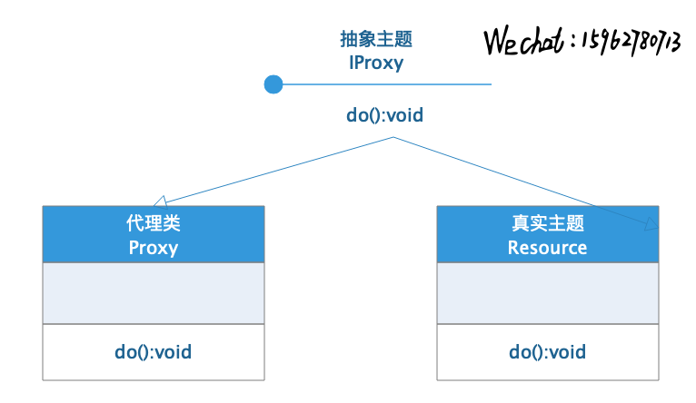
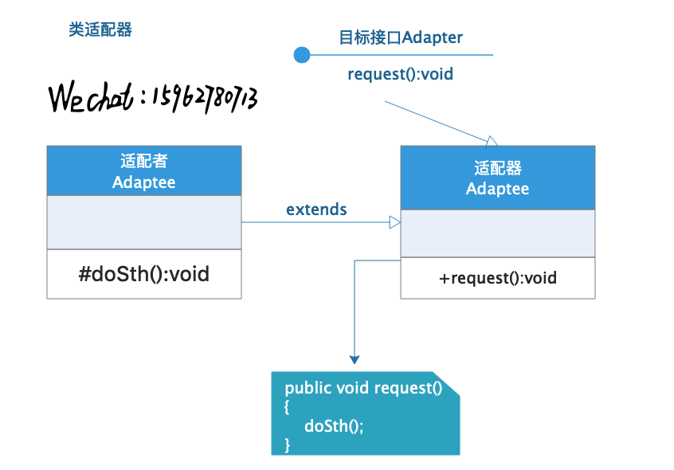
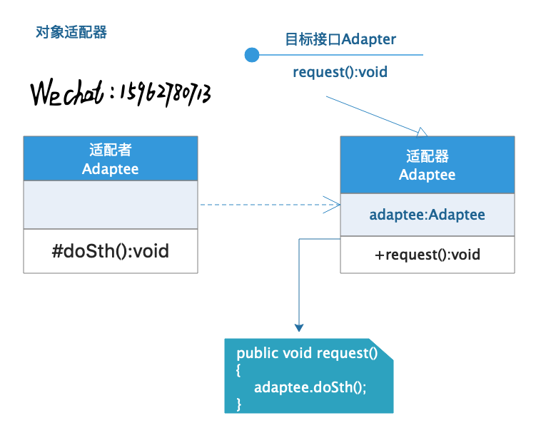
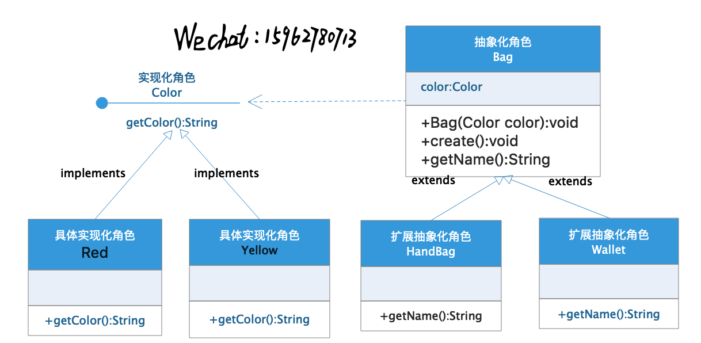
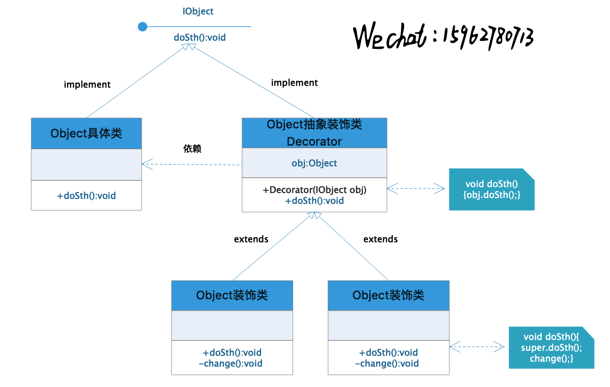
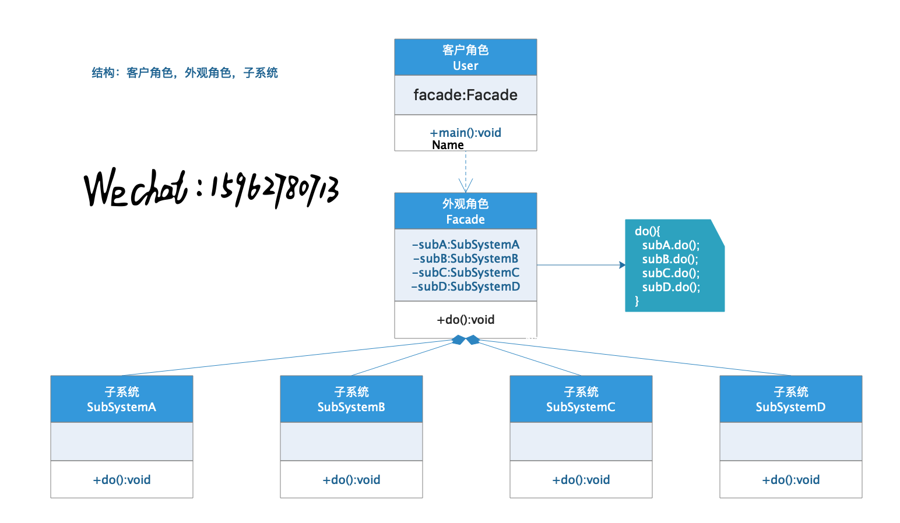
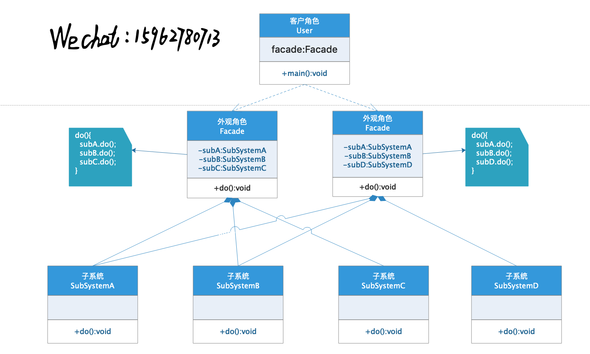
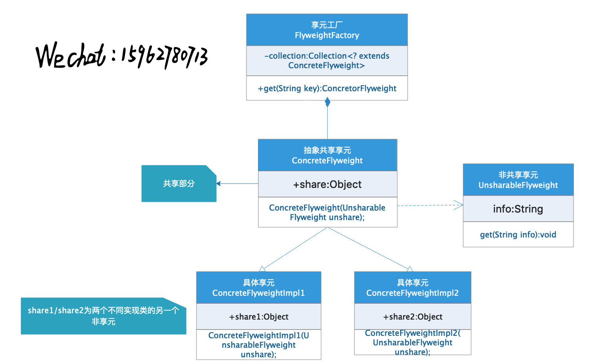
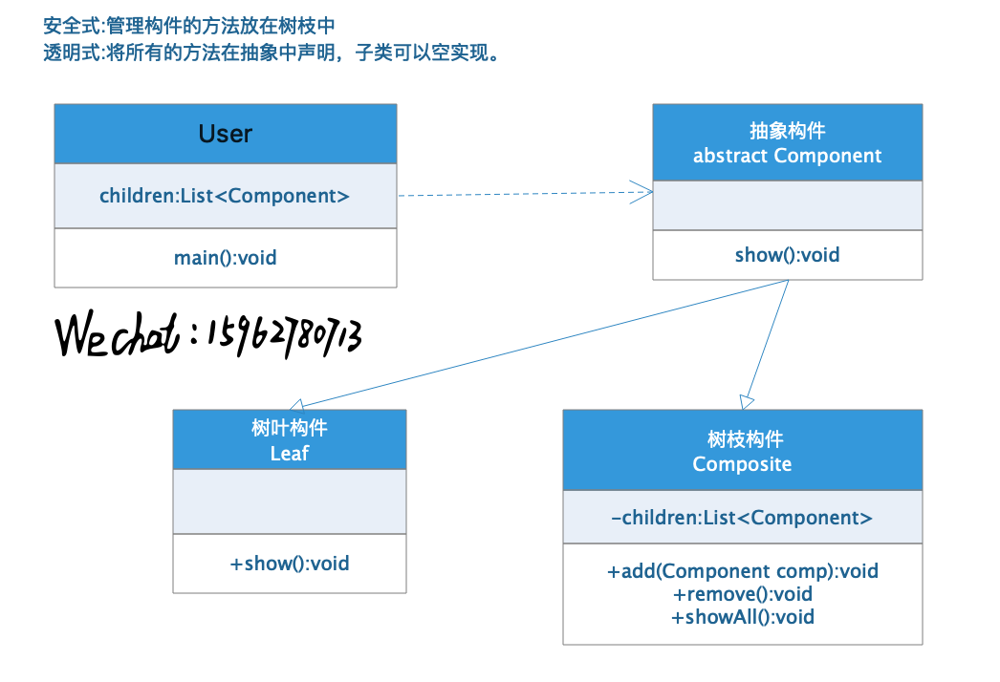
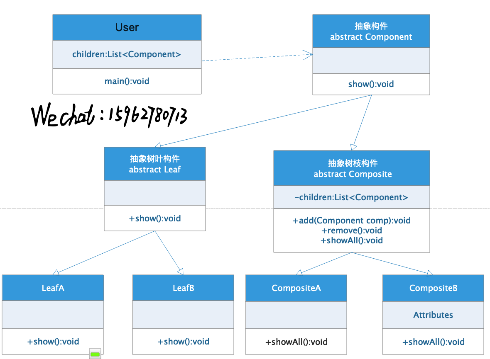

# 设计模式—结构型模式

​      结构型模式描述如何将类或者对象按照某种布局组成更大的结构。组合关系或者聚合关系的耦合度比继承低，满足“合成复用原则”。结构型模式主要有以下几种：

1. 代理模式：为某对象提供一种代理以控制对该对象的访问，用户通过代理访问该对象。
2. 适配器模式：将一个类的接口转换成用户希望的另一种接口，使得原本接口不兼容的能够一起工作起作用。
3. 桥接模式：将抽象和实现分离，使他们可以独立变化，用组合关系代替继承关系。
4. 装饰模式：动态的给对象增加一些功能。
5. 外观模式：为多个复杂的子系统提供一个一致的接口，是之更加容易被访问。
6. 享元模式：运用共享技术支持大量重复对象中共享元素的复用。
7. 组合模式：将对象组合成树结构的模式，使用户能够对总体对象和子对象具有一直的访问性。


## 代理模式

​      代理模式在框架中很常见，Spring AOP就是通过代理模式实现的，前面博文中已经介绍过如何自己实现AOP：

 [通过注解方式实现AOP.md](../基础/通过注解方式实现AOP.md) 。

​      代理模式主要有以下几个角色：

1. 抽象主题：通过接口或者抽象类声明需要代理的类的方法。
2. 真实主题：需要被代理的类，需要实现抽象主题。
3. 代理类：实现了抽象主题，并在声明的代理方法中实现被代理类的方法，在原有的方法上进行额外的操作。

​      代理模式的类结构如下：



​      举例说明：

- 创建抽象主题

```java
interface ProxyInterface {
    void say();
}
```

- 创建真实主题

```java
class RealObject implements ProxyInterface {
    @Override
    public void say() {
        System.out.println("hello");
    }
}
```

- 创建代理类

```java
class ProxyObject implements ProxyInterface {
    RealObject obj;
    @Override
    public void say() {
        if (obj == null) obj = new RealObject();
        preSay();
        obj.say();
        afterSay();
    }
    private void preSay() {
        System.out.println("proxy in...");
    }
    private void afterSay() {
        System.out.println("proxy out...");
    }
}
```

- 测试

```java
public class ProxyDemo {
    public static void main(String[] args) {
        ProxyObject proxy = new ProxyObject();
        proxy.say();
    }
}
//输出
//proxy in...
//hello
//proxy out...
```

​      在代理类中使用了真实主题对象，并在调用方法前后执行代理方法。代理类主要作用是隐藏了真实主题，在一定程度上起到了保护作用。

## 适配器模式

​      适配器模式是将一个类的接口转换为用户希望的另一个接口，解决了因为接口不兼容而不能一起工作的问题。一般情况下可以分为类适配器和对象适配器两种。

​      适配器主要包含以下几个结构：

1. 目标接口：用户所希望的接口，可以是抽象类或者接口。
2. 适配者：现存的组件，即需要被兼容的组件。
3. 适配器：将适配者转换成目标接口的样式的类。

### 类适配器

​      类适配器通过继承和实现接口的方式完成适配过程，类图如下：



​      举例说明：

- 创建目标接口

```java
interface Adapter {
    void request();
}
```

- 创建适配者

```java
class Adaptee {
    public void say() {
        System.out.println("hello from adapdee");
    }
}
```

- 创建适配者

```java
class ClassAdapter extends Adaptee implements Adapter {
    @Override
    public void request() {
        say();
    }
}
```

- 测试

```java
Adapter classAdapter = new ClassAdapter();
classAdapter.request();//hello from adapdee
```

### 对象适配器

​      对象适配器，只实现了目标接口，然后在适配器中依赖适配者，使用适配者调用原有方法实现适配的方式，类结构如下：



### 扩展--双向适配器

​      双向适配器可以将适配者转换为目标，也可以将目标转换为适配者。他的适配器类采用对象适配器实现，如下：

```java
class TwoWayAdapter implements Adapter, IAdaptee {
    private Adaptee adaptee;
    private Adapter adapter;

    public TwoWayAdapter(Adaptee adaptee) {
        this.adaptee = adaptee;
    }

    public TwoWayAdapter(Adapter adapter) {
        this.adapter = adapter;
    }

    @Override
    public void request() {
        System.out.println("适配器调用适配者...");
        adaptee.say();
    }

    @Override
    public void say() {
        System.out.println("适配者调用适配器");
        adapter.request();
    }
}
```

​      测试：

```java
System.out.println("--------");
TwoWayAdapter twoWayAdapter = new TwoWayAdapter(new ObjectAdapter(new Adaptee()));
twoWayAdapter.say();//hello from adapdee
System.out.println("--------");
TwoWayAdapter twoWayAdapter1 = new TwoWayAdapter(new Adaptee());
twoWayAdapter1.request();//hello from adapdee
```

## 桥接模式

​      现实生活中很多对象都是由多种元素组成，这些元素又会有多种变化，如果采用继承的方式将会产生很多种不同的类，使系统臃肿冗余。比如一个产品有两种元素组成，这两种元素分别有m种和n种种类，那么如果使用继承方式，将会有m*n种可能性。

​      桥接模式将抽象和实现分离，使他们可以独立变化，使用组合关系替代继承，降低了多可变的情况。

​      桥接模式主要包含以下几个结构：

1. 抽象化角色：定义抽象类，包含一个对实现化对象的引用。
2. 扩展抽象化：抽象化角色的子类，实现弗雷中的业务，并调用实现化对象的业务方法。
3. 实现化角色：定义实现化角色的接口。
4. 具体实现化：实现化角色的具体实现。

​      桥接模式的类图：



​      举例说明：女式背包有很多种种类，比如手提包，钱包等等，也有很多种颜色，使用桥接模式可以很方便的对这些属性进行组合。

- 创建抽象化角色

```java
abstract class Bag {
    public Color color;
    public Bag(Color color) {
        this.color = color;
    }
    abstract String getName();
    public void say() {
        System.out.println("i am " + getName() + ";my color is " + color.getColor());
    }
}
```

- 扩展抽象化角色

```java
class HandBag extends Bag {
    @Override
    String getName() {
        return "handBag";
    }
    public HandBag(Color color) {
        super(color);
    }
}

class Wallet extends Bag {
    @Override
    String getName() {
        return "wallet";
    }
    public Wallet(Color color) {
        super(color);
    }
}
```

- 实现化角色接口

```java
interface Color {
    String getColor();
}
```

- 具体实现化角色

```java
class Red implements Color {
    @Override
    public String getColor() {
        return "red";
    }
}

class Yellow implements Color {
    @Override
    public String getColor() {
        return "yellow";
    }
}
```

- 测试

```java
Bag handBag = new HandBag(new Red());
handBag.say();
Bag wallet = new Wallet(new Yellow());
wallet.say();
//i am handBag;my color is red
//i am wallet;my color is yellow
```

## 装饰模式

​      装饰者模式是指在不改变现有对象结构的情况下，动态的对其增加一些职责的模式。

​      装饰者模式有以下几个成员：

1. 抽象构件：定义一个抽象接口准备接受附加责任的对象。
2. 具体构件：实现抽象构件，通过装饰角色增加一些职责。
3. 抽象装饰：继承抽象构件，包含具体构件的实例。
4. 具体装饰：实现抽象装饰的一些方法。

​      装饰者模式的类图：



> ​       装饰者模式与代理模式都是在不改变原有类结构的基础上新增一些职责，两者功能一致，从类图上看，结构也很相似。  
>
> ​      装饰者模式关注于在一个对象上动态的添加方法，然而代理模式关注于控制对对象的访问。换句话 说，用代理模式，代理类可以对它的客户隐藏一个对象的具体信息。因此，当使用代理模式的时候，我们常常在一个代理类中创建一个对象的实例。并且，当我们使用装饰器模 式的时候，我们通常的做法是将原始对象作为一个参数传给装饰者的构造器。
>
> ​      可以用另外一句话来总结这些差别：**使用代理模式，代理和真实对象之间的的关系通常在编译时就已经确定了，而装饰者能够在运行时递归地被构造。**http://www.cnblogs.com/jaredlam/archive/2011/11/08/2241089.html)

​      举例说明：汽车的生产—汽车对象Car，在出厂的时候可以添加修饰，使之成为不同类型的车辆。

- 抽象构件

```java
interface Car {
    void create();
}
```

- 具体构件

```java
class MyCar implements Car {
    @Override
    public void create() {
        System.out.print("it's a car.");
    }
}
```

- 抽象装饰

```java
abstract class DecoratorCar implements Car {
    private Car car;
    public DecoratorCar(Car car) {
        this.car = car;
    }
    @Override
    public void create() {
        car.create();
    }
    abstract void change();
}
```

- 具体装饰

```java
class Truck extends DecoratorCar {
    public Truck(Car car) {
        super(car);
    }
    public void create() {
        super.create();
        change();
    }
    @Override
    protected void change() {
        System.out.println("it's a truck.");
    }
}

class Bus extends DecoratorCar {
    public Bus(Car car) {
        super(car);
    }
    @Override
    public void create() {
        super.create();
        change();
    }
    @Override
    void change() {
        System.out.println("it's a bus.");
    }
}
```

- 测试

```java
Car truck = new Truck(new MyCar());
truck.create();
//it's a car.it's a truck.
Car bus = new Bus(new MyCar());
bus.create();
//it's a car.it's a truck.
```

​      装饰模式在Java中最著名的应用就是I/O库的设计了，例如InputStream的子类FileInputStream，OutputStream的子类FileOutputStream等，他们都是装饰类。

## 外观模式

​      外观模式是一种通过为多个复杂的子系统提供一个一致的接口，使这些子系统更容易被访问。

​      外观模式通常有以下几种角色：

1. 外观角色：为多个子系统对外提供一个共同接口。
2. 子系统角色：实现系统的部分功能。
3. 客户角色：通过外观角色访问各个子系统的功能。

​      外观模式类图如下：



​      举例说明：京东购买流程包含下单，付款，打包等子系统支持

- 客户角色

```java
class User {
    private JDShopping jd = new JDShopping();
    public void buy() {
        jd.shooping();
    }
}
```

- 外观角色

```java
class JDShopping {
    private ChooseSystem chooseSystem = new ChooseSystem();
    private PaySystem paySystem = new PaySystem();
    private PackageSystem packageSystem = new PackageSystem();
    public void shooping() {
        chooseSystem.choose();
        paySystem.pay();
        packageSystem.packageGoods();
    }
}
```

- 子系统角色

```java
class ChooseSystem {
    public void choose() {
        System.out.println("下单中...");
    }
}

class PaySystem {
    public void pay() {
        System.out.println("付款中...");
    }
}

class PackageSystem {
    public void packageGoods() {
        System.out.println("打包中...");
    }
}
```

- 测试

```java
public static void main(String[] args) {
    new User().buy();
    //下单中...
    //付款中...
    //打包中...
}
```

### 扩展

​      如果需要引入其他子系统，可以使用如下结构：



## 享元模式

​      享元模式运用了共享技术最大限度的支持大量细粒度对象的复用。享元模式主要有以下几个角色：

1. 抽象享元角色：所有具体享元类的基类，为具体享元的公共接口。
2. 具体享元角色：实现抽象享元角色中规定的接口。
3. 非享元角色：不可共享的外部状态。
4. 享元工厂角色：负责创建和管理享元角色。

​      享元模式的类图如下：



​      举例说明：以围棋为例，黑白棋子除颜色以外都具备相同的属性，非享元角色为颜色，剩余为享元角色。

- 非享元角色

```java
class PiecesColor {
    private String color;
    public PiecesColor(String color) {
        this.color = color;
    }
    public String getColor() {
        return color;
    }
    @Override
    public int hashCode() {
        return this.color.hashCode();
    }
    @Override
    public boolean equals(Object color) {
        return this.color.equals(((PiecesColor) color).getColor());
    }
}
```

- 抽象享元角色

```java
abstract class Pieces {
    protected String shareName = "share";
    protected PiecesColor color;
    public Pieces(PiecesColor color) {
        this.color = color;
    }
    public String getShareName() {
        return shareName;
    }
    public PiecesColor getColor() {
        return color;
    }
    public void show() {
        System.out.println(this + "--shareName:" + shareName + "--color:" + color.getColor());
    }
}
```

- 具体享元角色

```java
class WhitePieces extends Pieces {
    public WhitePieces(PiecesColor color) {
        super(color);
    }
}

class BlackPieces extends Pieces {
    public BlackPieces(PiecesColor color) {
        super(color);
    }
}
```

- 享元工厂角色

```java
class PiecesFactory {
    //可以用任何形式储存
    Map<PiecesColor, Pieces> pieces = new HashMap<>(2);
    public Pieces get(PiecesColor color) {
        if (!pieces.containsKey(color)) {
            System.out.println("creating...");
            pieces.put(color, color.getColor().equals("white") ? new WhitePieces(color) : new BlackPieces(color));
        }
        return pieces.get(color);
    }
}
```

- 测试

```java
PiecesFactory factory = new PiecesFactory();
Pieces pieces = factory.get(new PiecesColor("white"));
pieces.show();
pieces = factory.get(new PiecesColor("black"));
pieces.show();
//是否不再创建享元角色，使用现有对象
pieces = factory.get(new PiecesColor("white"));
pieces.show();
pieces = factory.get(new PiecesColor("black"));
pieces.show();
```

- 结果

```java
creating...
com.wupengchoy.mystudy.designpattern.structure.WhitePieces@255316f2--shareName:share--color:white
creating...
com.wupengchoy.mystudy.designpattern.structure.BlackPieces@41906a77--shareName:share--color:black
com.wupengchoy.mystudy.designpattern.structure.WhitePieces@255316f2--shareName:share--color:white
com.wupengchoy.mystudy.designpattern.structure.BlackPieces@41906a77--shareName:share--color:black
```

​      以上结果可以看出第二次获取对象的时候享元角色并没有重新创建，而是使用之前创建的对象。

## 组合模式

​      组合模式又叫部分-整体模式，将对象组合成树状的层次结构的模式，表示部分和整体的关系。通常有以下几个角色：

1. 抽象构件角色：为树叶结构和树枝结构声明公共接口，并实现默认行为。
2. 树叶结构角色：组合中的叶子节点对象，没有子节点。
3. 树枝结构对象：组合中的分支节点对象，有子节点。

​      组合模式的实现方式可分为透明式和安全式，类图和区别如下：



​      举例说明：超市购物袋子为例，大袋子里有小袋子，还有其他商品，小袋子里还有其他商品。

- 抽象构件

```java
abstract class BagAndGoods {
    abstract void show();
}
```

- 树叶结构

```java 
class Milk extends BagAndGoods {
    public void show() {
        System.out.println("i am milk.");
    }
}

class Apple extends BagAndGoods {
    public void show() {
        System.out.println("i am apple.");
    }
}
```

- 树枝结构

```java
class Bags extends BagAndGoods {
    private List<BagAndGoods> goods = new ArrayList<>();
    public void add(BagAndGoods good) {
        goods.add(good);
    }
    @Override
    public void show() {
        for (BagAndGoods good : goods) {
            good.show();
        }
    }
}
```

- 测试

```java
Bags bigBag = new Bags();
bigBag.add(new Milk());
Bags milddleBag = new Bags();
milddleBag.add(new Apple());
milddleBag.add(new Apple());
bigBag.add(milddleBag);
//展示袋子中购买的物品
bigBag.show();
//i am milk.
//i am apple.
//i am apple.
```

### 扩展

​      如果有多个树枝和树叶，还可以对树枝和树叶再进行抽象，组成如下格式：

