# 设计模式— 行为型模式

> ​      行为型模式描述的死程序运行时复杂的流程控制，描述了多个类或者对象之间怎样相互协调合作，涉及算法与对象之间的职责分配。

​      行为型模式是23中设计模式中最为庞大的，包括以下11中：

[TOC]

## 模板方法模式(Template Method)

> 定义：模板方法定义一个操作中的算法骨架，将算法中的一些步骤延迟到子类中去，是的子类可以在不改变原有算法结构的情况下重新定义这些算法步骤。

​      模板方法模式主要包含一下几种结构：

- 抽象类：定义一个算法的轮廓和骨架
  - 模板方法：定义算法骨架，按照某种顺序调用其他方法。
  - 基本方法：算法中的基本步骤。
    - 抽象方法：需要由子类实现的方法。
    - 具体方法：在抽象类中已经实现的方法，子类可以重写或继承他。
    - 钩子方法：抽象类中实现，主要用来判断是否要使用子类重写的方法。

- 具体子类：继承了抽象类并实现抽象方法。

​      根据以上角色结构可以大致画出如下类图：

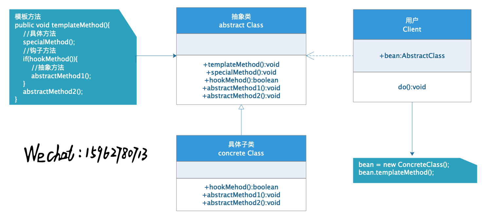

​      举例说明：五一小长假出去旅游，需要选择地点，然后预定计划，最后选择出行方式，出行方式可是飞机，火车或者自驾游等。在这里选择地点，定计划，选择出行方式可以理解为模板方法，选择出行方式是抽象方法，判断出行方式为钩子方法，定计划步骤可以作为具体方法实现。

​      代码如下：

- 抽象类

```java
//抽象类
abstract class Travel {
    protected String destinate;
    //模板方法
    protected Travel(String destinate) {
        System.out.println("去"+destinate+"...");
        this.destinate = destinate;
    }
    public void travel() {
        plan();
        if (travelHook()) {
            byTicket();
        } else {
            byCar();
        }
    }
    //具体方法
    protected void plan() {
        System.out.println("预定计划...");
    }
    //钩子方法
    protected boolean travelHook() {
        return "beijing".equals(this.destinate);
    }
    //抽象方法
    abstract void byTicket();
    protected void byCar() {
        System.out.println("自驾游...");
    }
}
```

- 具体子类

```java
//具体子类
class Beijing extends Travel {
    public Beijing(String destinate) {
        super(destinate);
    }
    @Override
    void byTicket() {
        System.out.println("买飞机票...");
    }
}

//具体子类
class Shanghai extends Travel{
    public Shanghai(String destinate)
    {
        super(destinate);
    }
    @Override
    void byTicket() {
    }
}
```

- 测试

```java
Travel beijing = new Beijing("beijing");
beijing.travel();
Travel shanghai = new Shanghai("shanghai");
shanghai.travel();
```

- 输出结果

```java
去beijing...
预定计划...
买飞机票...
去shanghai...
预定计划...
自驾游...
```


## 策略模式(Strategy)

> ​      定义：定义了一系列算法，并将每个算法封装起来，使之可以相互替代，并且算法的改变不会影响到使用者。

​      策略模式的结构如下：

- 抽象策略：定义了一个公共接口，每个算法可以实现这个接口，实现调用方式的统一。
- 具体策略：实现抽象策略的捷库，提供具体的算法。
-  环境类：拥有一个策略类的引用，最终给客户端调用。

​      根据以上结构可以画出如下类图：

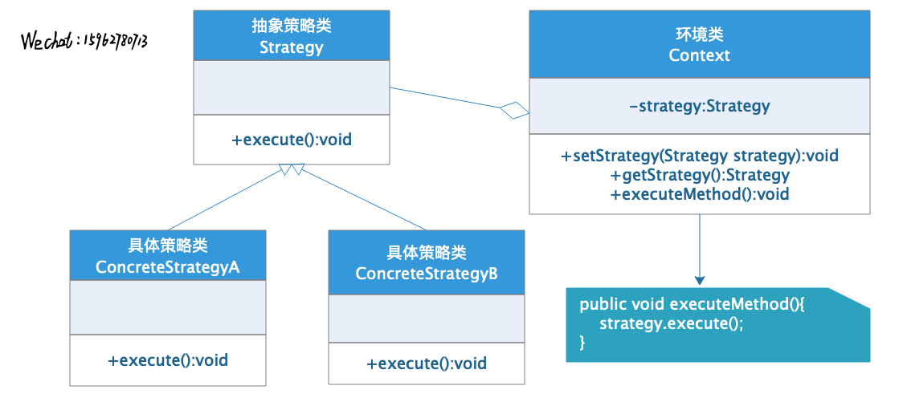

​      模式的实现：

- 抽象策略

```java
//抽象策略类
interface Strategy {
    void execute();
}
```

- 具体策略

```java
//具体策略类
class StrategyA implements Strategy {
    @Override
    public void execute() {
        System.out.println("do as strategyA...");
    }
}

//具体策略类
class StrategyB implements Strategy {
    @Override
    public void execute() {
        System.out.println("do as strategyB...");
    }
}
```

- 环境类

```java
//环境类
class Context {
    private Strategy strategy;

    public void setStrategy(Strategy strategy) {
        this.strategy = strategy;
    }

    public void executeMethod() {
        this.strategy.execute();
    }
}
```

- 客户端

```java
Context context = new Context();
context.setStrategy(new StrategyA());
context.executeMethod();//do as strategyA...
context.setStrategy(new StrategyB());
context.executeMethod();//do as strategyB...
```

​      对于一个庞大的系统来说，通常情况下会有很多策略，此时如果直接使用原始的策略模式将会对策略的管理显得异常困难。将策略模式与工厂模式相结合而成的策略工厂模式将会使得对策略的管理更加方便。升级后的类图如下，代码比较简单，不做过多详解。

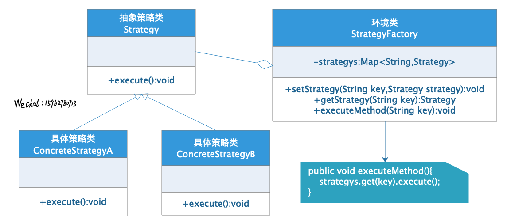

## 命令模式(Command)

> ​      定义：将一个请求封装成一个对象，使发出的请求的责任和执行请求的责任分割开。

​      命令模式在平时生活中有很多场景，比如去餐厅吃饭，点餐时点的不同的菜品相当于多个请求，随后这多个不同的菜会到厨房分发给不同的厨师，此时相当于执行请求的角色，在这个场景中就使得请求和执行分割，我们点菜的人并不知道厨房具体是如何执行的。

​      命令模式结构：

- 抽象命令类：声明执行命令的接口，拥有执行命令的抽象方法。
- 具体命令角色：实现抽象命令类，通过调用实现者/接收者完成命令的执行操作。
- 实现者/操作者：实现具体命令的执行操作。
- 调用者/请求者：请求的发送者，一般调用命令角色，不直接调用实现者/操作者。

​      类结构如下：

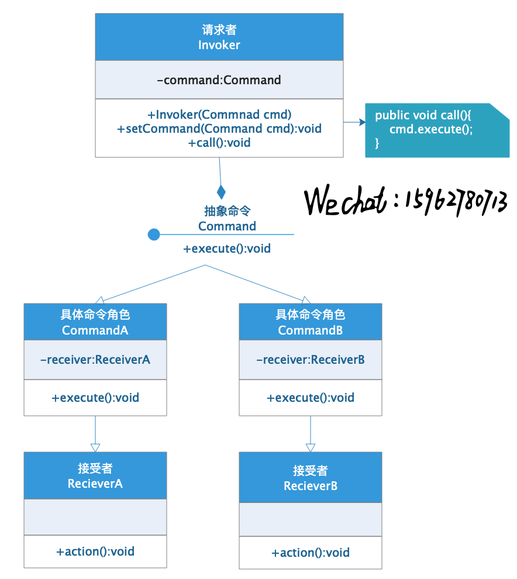

​      模式实现：

- 抽象命令角色

```java
//抽象命令角色
interface ICommand {
    void execute();
}
```

- 具体命令角色

```java
//具体命令角色
class CommandA implements ICommand {
    private ReceiverA receiver;

    public CommandA() {
        receiver = new ReceiverA();
    }

    @Override
    public void execute() {
        receiver.action();
    }
}

//具体命令角色
class CommandB implements ICommand {
    private ReceiverB receiver;

    public CommandB() {
        receiver = new ReceiverB();
    }

    @Override
    public void execute() {
        receiver.action();
    }
}
```

- 请求者

```java
//请求者
class Invoker {
    private ICommand cmd;

    public Invoker(ICommand cmd) {
        this.cmd = cmd;
    }

    public void call() {
        cmd.execute();
    }
}
```

- 测试

```java
new Invoker(new CommandA()).call();//receiverA do...
new Invoker(new CommandB()).call();//receiverB do...
```

​      通常情况下，一个请求需要多个接受者去完成，此时可以将**命令模式**和之前的**组合模式**相结合，组成**宏命令模式**又叫**组合命令模式**，具体类图如下，代码详见文章尾的GitHub地址。

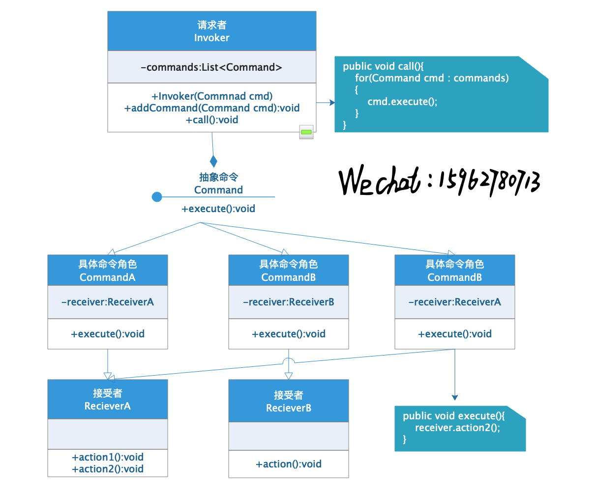

## 职责链模式(Chain of Responsibility)

> ​      定义：为避免请求发送者与多个请求处理者耦合在一起，将所有的请求处理者通过一个对象记住下一个对象的引用而形成一条链式结构；当有请求发生时，请求将沿着这条链传递，直到有对象处理它为止。

​      例如公司请假，请假三天以上和三天以内的审批人不同，如果将所有的审批人都依赖于请求者，那么请求者中都需要依赖所有的审批人对象，如果将请假请求沿着审批人的链一个个传递下去，直到有人审批或者拒绝，请求停止，此时请求者对象只需要依赖一个审批人对象，从一定程度上降低了耦合。

​      模式结构：

- 抽象处理者：定义一个处理请求的接口，包含抽象方法和一个后继链接。
- 具体处理者：实现抽象处理者的处理方法，并判断是否能处理当前请求，如果不能则将请求传递给下一个处理者。
- 客户类：创建处理链接，并向链头提交请求。

​      类结构：

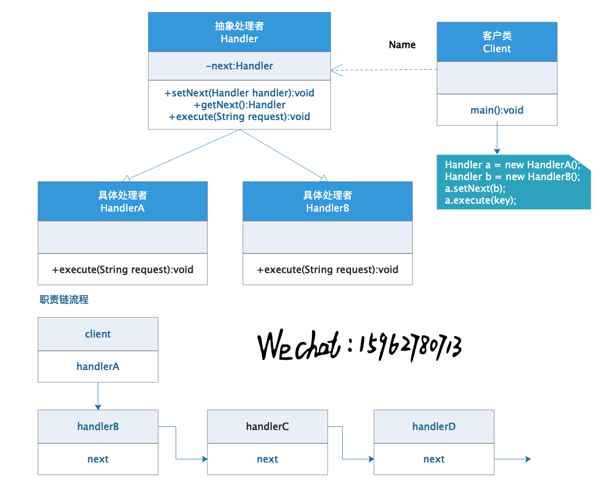

​      模式实现：

- 抽象处理者

```java
//抽象处理者
abstract class IHandler {
    private IHandler next;
    abstract void execute(String key);
    public void setNext(IHandler next) {
        this.next = next;
    }
    public IHandler getNext() {
        return this.next;
    }
}
```

- 具体处理者

```java
//具体处理者
class HandlerA extends IHandler {
    @Override
    void execute(String key) {
        if ("a".equals(key)) {
            System.out.println("handlerA do....");
            return;
        }
        if (this.getNext() != null) {
            this.getNext().execute(key);
            return;
        }
        System.out.println("请求未处理...");
    }
}
//具体处理者
class HandlerB extends IHandler {
    @Override
    void execute(String key) {
        if ("b".equals(key)) {
            System.out.println("handlerB do....");
            return;
        }
        if (this.getNext() != null) {
            this.getNext().execute(key);
            return;
        }
        System.out.println("请求未处理...");
    }
}
```

- 客户类

```java
IHandler handlerA = new HandlerA();
IHandler handlerB = new HandlerB();
handlerA.setNext(handlerB);
handlerA.execute("a");//handlerA do....
handlerA.execute("b");//handlerB do....
handlerA.execute("c");//请求未处理...
```

## 状态模式(State)

> ​      定义：对有状态的对象，把复杂的判断逻辑提取到不同的对象中，允许对象再起内部状态发生变化时改变其行为。

​      模式结构：

- 环境角色：定义客户感兴趣的接口，维护一个当前状态，并将与状态相关的操作委托给当前状态对象处理。
- 抽象状态：定义接口，统一具体状态的行为准则。
- 具体状态：实现抽象状态对应的行为。

​      类结构：

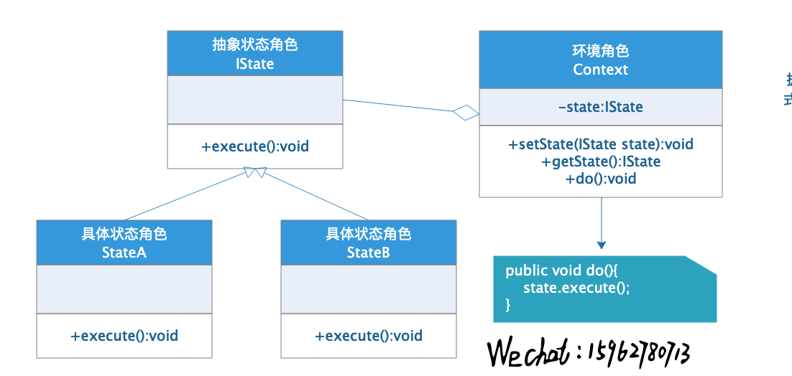

​      举例说明：多线程在执行过程中可以存在多个状态，可以简单的使用状态模式设计一个多线程的状态转换程序，代码如下：

- 抽象角色

```java
//抽象状态
interface IThreadState {
    void execute();
}
```

- 具体状态

```java
//具体状态
class New implements IThreadState {
    @Override
    public void execute() {
        System.out.println("thread new...");
    }
}

//具体状态
class Runnable implements IThreadState {
    @Override
    public void execute() {
        System.out.println("thread runnable...");
    }
}

//具体状态
class Running implements IThreadState {
    @Override
    public void execute() {
        System.out.println("thread running...");
    }
}

//具体状态
class Dead implements IThreadState {
    @Override
    public void execute() {
        System.out.println("thread dead...");
    }
}
```

- 环境角色

```java
//环境角色
class ThreadContext {
    private IThreadState state;

    public void start() {
        this.state = new New();
        this.state.execute();
    }

    public void runnable() {
        this.state = new Runnable();
        this.state.execute();
    }

    public void runnung() {
        this.state = new Running();
        this.state.execute();
    }

    public void stop() {
        this.state = new Dead();
        this.state.execute();
    }
}
```

- 测试

```java
ThreadContext context = new ThreadContext();
context.start();//thread new...
context.runnable();//thread runnable...
context.runnung();//thread running...
context.stop();//thread dead...
```

​      很多情况下，可能有多个环境享用一组状态，此时可以将状态模式和**享元模式**结合起来使用，在环境类中储存共享的状态。

## 观察者模式(Observer)

> ​      定义：多个对象之间存在一对多的依赖关系，当一个对象的状态发生改变时，所有依赖于他的对象都会得到通知并自动更新。

​      模式结构：

- 抽象主题：提供了保存观察者对象的聚集类，包括增加和减少观察者的方法以及通知方法等。
- 具体主题：继承抽象主题，实现抽象主题中的通知方法。
- 抽象观察者：一个接口，定义了更新的方法。
- 具体观察者：实现了抽象观察者中的更新方法。

​      注意：实现观察者模式时，具体目标和具体观察者之间不能直接调用，否则两者之间将紧密耦合在一起，违反了面对对象的设计原则。

​      类结构：

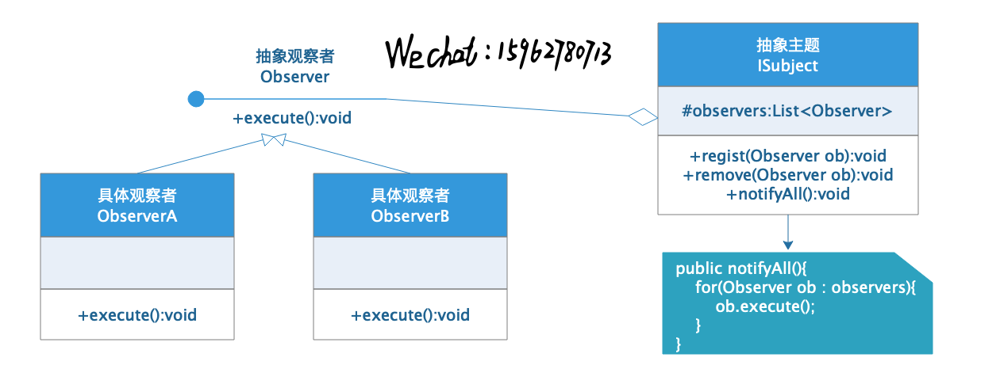

​      代码实现：

- 抽象观察者

```java
//抽象观察者
interface IObserver {
    void execute();
}
```

- 具体观察者

```java
//具体观察者
class ObserverA implements IObserver {
    @Override
    public void execute() {
        System.out.println("observerA get...");
    }
}

//具体观察者
class ObserverB implements IObserver {
    @Override
    public void execute() {
        System.out.println("observerB get...");
    }
}
```

- 抽象主题

```java
//抽象主题
abstract class Subject {
    protected List<IObserver> observers = new ArrayList<>();

    public void regiest(IObserver observer) {
        observers.add(observer);
    }

    public void remove(IObserver observer) {
        observers.remove(observer);
    }

    abstract void notifyObservers();
}
```

- 具体主题

```java
//具体主题
class ConcreteSubject extends Subject {
    @Override
    void notifyObservers() {
        for (IObserver observer : observers) {
            observer.execute();
        }
    }
}
```

- 测试

```java
Subject subject = new ConcreteSubject();
subject.regiest(new ObserverA());
subject.regiest(new ObserverB());
subject.notifyObservers();
//observerA get...
//observerB get...
```

​      Java中通过java.util.Observable(抽象目标)和java.util.Observer(抽象观察者)定义了观察者模式，只要实现他们就可以编写观察者模式实例。

## 中介者模式(Mediator)

> ​      定义：定义一个中介对象来封装一系列对象之间的交互，使原有对象之间的耦合松散，并且可以独立的改变他们之间的交互。

​      模式结构：

- 抽象中介者：中介者的接口，定义了对象转发，注册等接口。
- 具体中介者，实现中介者接口，定义一个list管理同事对象。
- 抽象同事类：定义同事类接口，保存中介者对象。
- 具体同事类：抽象同事类的实现类。

​      类结构：

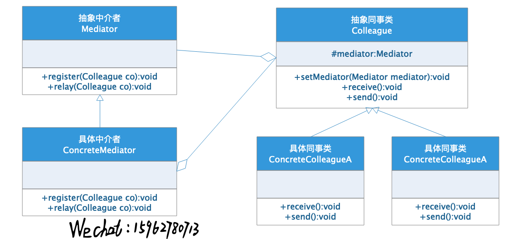

​      代码实现：

- 抽象中介者

```java
//抽象中介者
interface Mediator {
    void register(Colleague colleague);
    void relay(Colleague colleague);
}
```

- 抽象同事类

```java
//抽象同事类
abstract class Colleague {
    protected Mediator mediator;
    public void setMediator(Mediator mediator) {
        this.mediator = mediator;
    }
    abstract void receive();
    abstract void send();
}
```

- 具体同事类

```java
//具体同事类
class ColleagueA extends Colleague {
    @Override
    void receive() {
        System.out.println("colleagueA received...");
    }

    @Override
    void send() {
        System.out.println("colleagueA send...");
        mediator.relay(this);//请求中介者转发
    }
}

//具体同事类
class ColleagueB extends Colleague {
    @Override
    void receive() {
        System.out.println("colleagueB received...");
    }

    @Override
    void send() {
        System.out.println("colleagueB send...");
        mediator.relay(this);//请求中介者转发
    }
}
```

- 具体中介者

```java
//具体中介者
class ConcreteMediator implements Mediator {
    private List<Colleague> colleagus = new ArrayList<>();

    @Override
    public void register(Colleague colleague) {
        colleagus.add(colleague);
        colleague.setMediator(this);
    }

    @Override
    public void relay(Colleague colleague) {
        for (Colleague co : colleagus) {
            if (!co.equals(colleague)) {
                co.receive();
            }
        }
    }
}
```

- 测试

```java
Mediator mediator = new ConcreteMediator();
Colleague a = new ColleagueA();
Colleague b = new ColleagueB();
mediator.register(a);
mediator.register(b);
a.send();
b.send();
//colleagueA send...
//colleagueB received...
//colleagueB send...
//colleagueA received...
```


> ​      观察者模式和中介者模式功能很类似，都是一个对象改变状态通知其他对象。不同的是，观察者拥有所有被观察对象的所有引用，通过接口类型依赖，而中介者模式，变化的对象不能直接与被通知的对象直接联系，他不知道到底有多少对象被通知了，而是通过第三方进行操作。
>
> ​      具体内容可以参考:http://www.sohu.com/a/207062452_464084

## 迭代器模式(Iterator)

> ​      定义：提供一个对象来顺序访问聚合对象中的一系列数据，二部暴露聚合对象的内部表示。

​      模式结构：

- 抽象聚合角色：定义储存，添加，删除等聚合对象操作。
- 具体聚合角色：实现抽象聚合类，并实现返回一个迭代器对象的方法。
- 抽象迭代器：定义遍历和访问聚合对象的接口。
- 具体迭代器：实现抽象迭代器中的方法。

​      类结构：

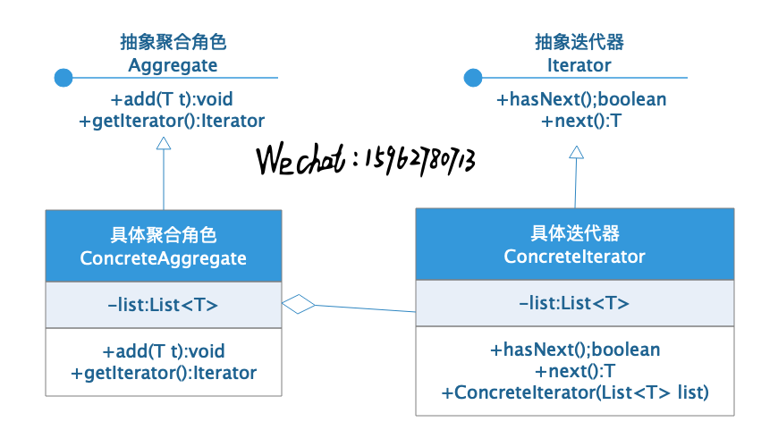

​      代码实现：

- 抽象聚合角色

```java
//抽象聚合角色
abstract class Aggregate<T> {
    protected List<T> list;

    public void add(T t) {
        list.add(t);
    }

    abstract Iterator getIterator();
}
```

- 抽象迭代器

```java
//抽象迭代器
interface Iterator<T> {
    boolean hasNext();

    T next();
}
```

- 具体聚合角色

```java
//具体聚合角色
class ConcreteAggregate extends Aggregate {
    public ConcreteAggregate() {
        list = new ArrayList();
    }

    @Override
    Iterator getIterator() {
        return new ConcreteIterator(list);
    }
}
```

- 具体迭代器

```java
//具体迭代器
class ConcreteIterator<T> implements Iterator {
    private List<T> list;
    private int index = 0;

    public ConcreteIterator(List<T> list) {
        this.list = list;
    }

    @Override
    public boolean hasNext() {
        return list.size() > index;

    }

    @Override
    public T next() {
        return list.get(index++);
    }
}
```

- 测试

```java
Aggregate aggregate = new ConcreteAggregate();
aggregate.add("a");
aggregate.add("b");
aggregate.add("c");
aggregate.add("d");
Iterator iterator = aggregate.getIterator();
while (iterator.hasNext()) {
    System.out.println(iterator.next());
}
//a
//b
//c
//d
```

​      通常情况下，迭代器模式还可以与组合模式相结合使用，使用迭代器遍历类似树结构的数据，类图如下，代码不做过多展示。

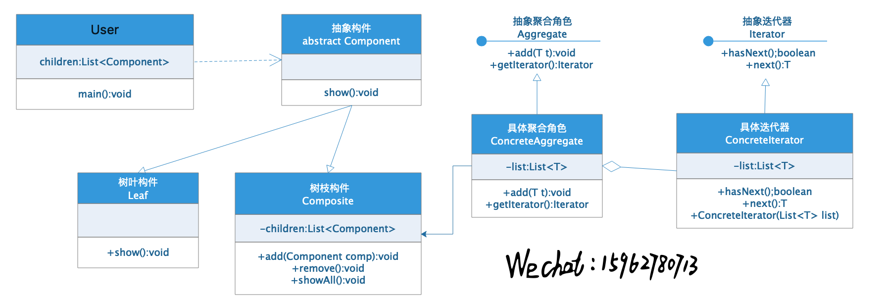


## 访问者模式(Visitor)

> ​      定义：将作用于某种数据结构种的各元素的操作分离出来封装成独立的类，使其在不改变数据结构的前提下可以添加作用于这些元素的新操作，为数据结构种的每个元素提供多种访问方式。

​      模式结构：

- 抽象访问者：定义一个访问具体元素的接口。
- 具体访问者：实现抽象访问者，具体每个访问操作。
- 抽象元素：声明元素接口，其中包含接收访问者访问的方法。
- 具体元素：实现抽象元素中的具体接收访问方法。
- 对象结构：包含元素角色的容器。

​      类结构：

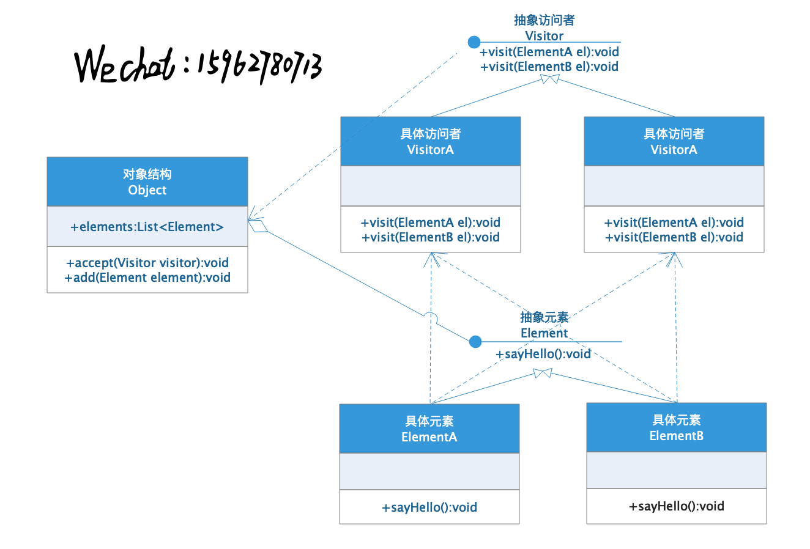

​      代码实现：

- 抽象元素

```java
//抽象元素
interface Element {
    void sayHello();
}
```

- 具体元素

```java
//具体元素
class ElementA implements Element {
    @Override
    public void sayHello() {
        System.out.println("hi,i am elementA...");
    }
}

class ElementB implements Element {
    @Override
    public void sayHello() {
        System.out.println("hi,i am elementB...");
    }
}
```

- 抽象访问者

```java
//抽象访问者
interface Visitor {
    void visit(Element el);
}
```

- 具体访问者

```java
//具体访问者
class VisitorA implements Visitor {
    @Override
    public void visit(Element el) {
        System.out.print("visitorA Knock knock...");
        el.sayHello();
    }
}

class VisitorB implements Visitor {
    @Override
    public void visit(Element el) {
        System.out.print("visitorB Knock knock...");
        el.sayHello();
    }
}
```

- 结构类

```java
//结构类
class Structure {
    private List<Element> elements = new ArrayList<>();

    public void add(Element el) {
        this.elements.add(el);
    }

    public void accept(Visitor visitor) {
        elements.forEach(el -> visitor.visit(el));
    }
}
```

- 测试

```java
Structure structure = new Structure();
structure.add(new ElementA());
structure.add(new ElementB());
structure.accept(new VisitorA());
System.out.println("-------------");
structure.accept(new VisitorB());
```

- 输出

```java
visitorA Knock knock...hi,i am elementA...
visitorA Knock knock...hi,i am elementB...
-------------
visitorB Knock knock...hi,i am elementA...
visitorB Knock knock...hi,i am elementB...
```

​      通常情况下，对象结构种有多个具体元素，此时还可以将访问者模式和组合模式相结合，在遍历这多个具体元素的时候还可以使用上面的迭代器模式，很是灵活。

## 备忘录模式(Memento)

> ​      定义：在不破坏封装性的前提下，捕获一个对象的内部状态，并在该对象之外保存这个对象，以便以后需要时能将这个对象恢复到之前的状态。

​      模式结构：

- 发起人角色：记录当前时刻的内部状态信息，提供创建备忘录和恢复备忘录的功能。
- 备忘录角色：储存发起人的内部状态，并提供在必要的时候将这些状态提供给发起人。
- 管理者角色：对备忘录进行管理，并提供保存和获取备忘录的功能。

​      类结构：

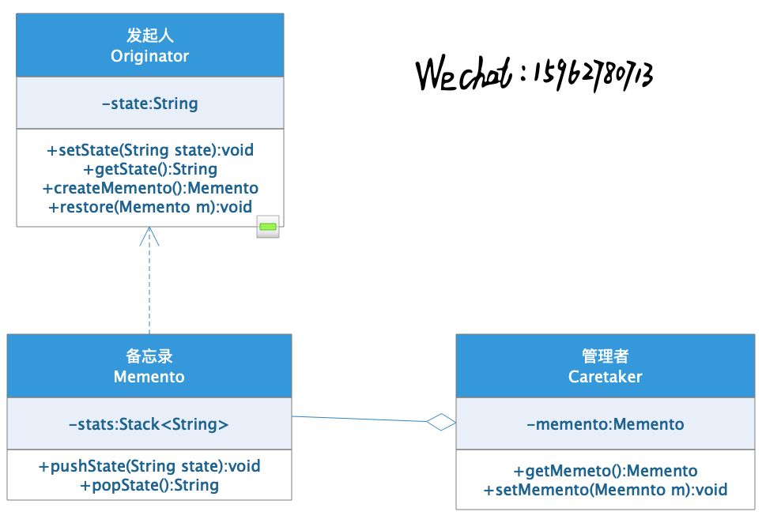

​      代码实现：

- 备忘录

```java
//备忘录
class Memento {
    private Stack<String> states = new Stack<>();

    public void pushState(String state) {
        states.push(state);
    }

    public String popState() {
        return states.peek() != null ? states.pop() : "";
    }
}
```

- 管理者

```java
//管理者
class Caretaker {
    private Memento memento;

    public void setMemento(Memento m) {
        this.memento = m;
    }

    public Memento getMemento() {
        return this.memento;
    }
}
```

- 发起人

```java
//发起人
class Originator {
    private String state;

    public void setState(String state) {
        this.state = state;
    }

    public String getState() {
        return this.state;
    }

    public Memento createMemento() {
        Memento m = new Memento();
        m.pushState(this.state);
        return m;
    }

    public void restoreState(Memento m) {
        this.state = m.popState();
    }
}
```

- 测试

```java
Originator originator = new Originator();
Caretaker caretaker = new Caretaker();
caretaker.setMemento(originator.createMemento());
System.out.println("------set------");
originator.setState("1");
System.out.println(originator.getState());
caretaker.getMemento().pushState("1");
originator.setState("2");
System.out.println(originator.getState());
caretaker.getMemento().pushState("2");
originator.setState("3");
System.out.println(originator.getState());
caretaker.getMemento().pushState("3");
System.out.println("------restore------");
originator.restoreState(caretaker.getMemento());
System.out.println(originator.getState());
originator.restoreState(caretaker.getMemento());
System.out.println(originator.getState());
originator.restoreState(caretaker.getMemento());
System.out.println(originator.getState());
```

- 输出

```java
------set------
1
2
3
------restore------
3
2
1
```


## 解释器模式(Interpreter)

> 定义：给分析对象一个语言，并定义该语言的文法表示，再设计一个解释器来解析语言中的句子。

​      刚开始看到解释器模式的定义的时候，一脸懵逼。编译器模式常用于对简单语言的编译或分析。在介绍编译器模式之前，首先介绍一下文法，句子，语法树等概念。

> 1. 文法：描述语言语法结构的形式规则。比如<句子> ::=<主语><谓语><宾语>，<名词> ::= 大学生|课程|语文。“::=”表示定义为。用“<”，“>”包含的是**非终结符**，没有括住的是**终结符**（这两个概念后面要用）。
> 2. 句子：语言的基本单位。
> 3. 语法树：句子结构的一种树形表示。

​      介绍完上面的几个概念，看一下解释器模式的几个主要角色：

1. 抽象表达式角色：定义解释器的接口，约定解释器的解释操作。
2. 终结符表达式角色：抽象表达式的子类，用来实现文法中与终结符相关的操作。
3. 非终结符表达式角色：抽象表达式子类，用来实现文法中与非终结符相关的操作。
4. 环境角色：包含解释器需要的数据或者公共部分。

​      **举例说明**：公交车刷卡的时候只有广州和深圳的老年人和小学生是免费的，其他的都是2元车票钱，刷卡机需要根据输入的信息判定是否需要扣钱，那么文法可以定义为：<结果> ::= <城市>的<角色>。根据上面的模式角色，具体的模式类图如下：

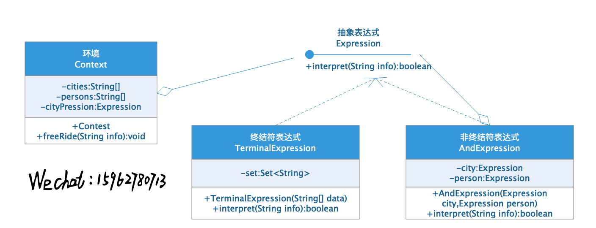

​      具体代码设计如下：

- 抽象表达式

```java
//抽象表达式
interface Expression {
    boolean interpret(String info);
}
```

- 终结符表达式

```java
//终结符表达式
class TerminalExpression implements Expression {
    private Set<String> set;

    public TerminalExpression(String[] data) {
        this.set = new HashSet<>(Arrays.asList(data));
    }

    @Override
    public boolean interpret(String info) {
        return set.contains(info);
    }
}
```

- 非终结符表达式

```java
//非终结符表达式
class AndExpression implements Expression {
    private Expression city;
    private Expression person;

    public AndExpression(Expression city, Expression person) {
        this.city = city;
        this.person = person;
    }

    @Override
    public boolean interpret(String info) {
        String[] infos = info.split("的");
        return city.interpret(infos[0]) && person.interpret(infos[1]);
    }
}
```

- 环境觉得—此处直接使用main方法作为环境

```java
//环境
public static void main(String[] args) {
    Expression city = new TerminalExpression(new String[]{"深圳", "广州"});
    Expression person = new TerminalExpression(new String[]{"老年人", "小学生"});
    Expression bus = new AndExpression(city, person);
    //排队上车
    for (String p : new String[]{"深圳的老人", "广州的小学生", "深圳的年轻人", "广州的妇女", "深圳的小学生"}) {
        if (bus.interpret(p)) {
            System.out.println(p + "乘车免费...");
            continue;
        }
        System.out.println(p + "刷卡2元...");
    }
}
```

- 输出结果

```java
深圳的老人刷卡2元...
广州的小学生乘车免费...
深圳的年轻人刷卡2元...
广州的妇女刷卡2元...
深圳的小学生乘车免费...
```

**END**

> ​       文中涉及的代码详见:https://github.com/wupengchoy/helloblog/tree/master/parent/mystudy/src/main/java/com/wupengchoy/mystudy/designpattern

​      至此，经过三周的时间，23种设计模式的概念和大致使用方法都已经大体的学习完成，但这并不意味着结束。在实际应用中，我们不仅仅停留在概念以及一些简单的例子上，还需要知道每种模式具体在业务中如何使用，以及如何选择使用何种模式。了解熟悉每种设计模式的优缺点，除此之外，还需要熟悉设计模式中设计的一些法则和算法。加油，共勉！！

​      学海无涯，苦海作舟。争取早日掉光头发，因为光头……强。


> **本系列参考人民邮电出版社《软件设计模式(Java版)》**
